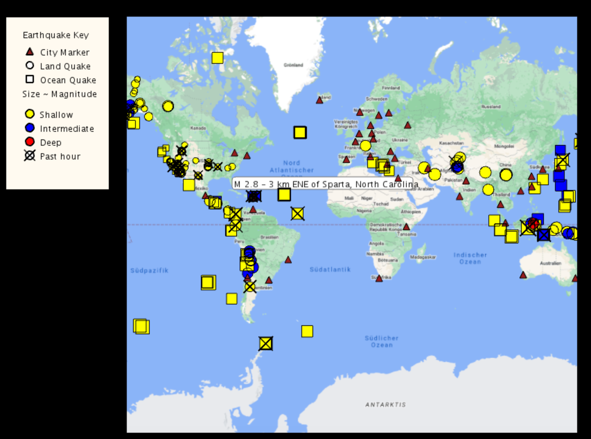
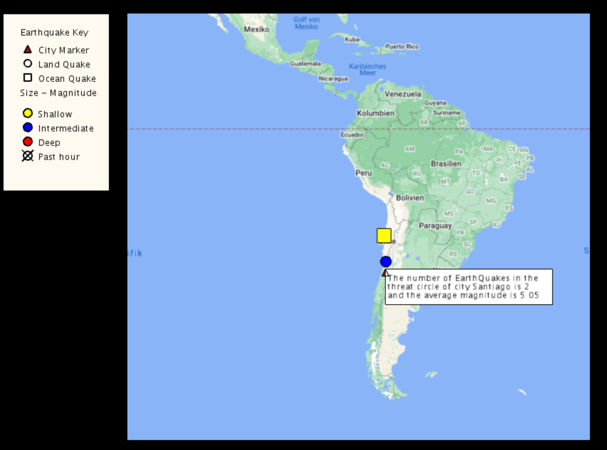
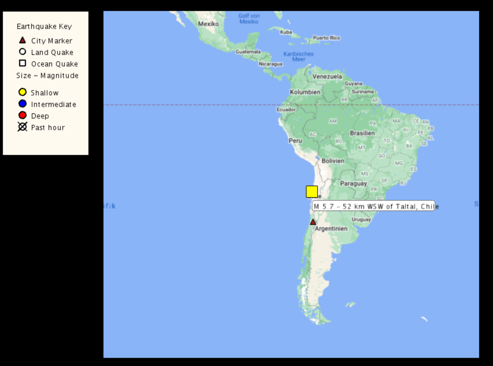

# Interactive Earthquake Map
## Description
This is a Java application that ultilizes the processing library, Unfolding library and Google Maps API to display a interactive map that tracks real time earthquakes information around the globe. The earthquake data are downloaded and parsed from USGS.gov
## What is does
The map displays real time earthquakes information as well as the major cities around the globe. Earthquakes' depth,magnitude and whether they are land quakes or ocean quakes are differentiated by markers of different shapes, colors and sizes.\
Additional functions include:
- Earthquake's detail are displayed when hovering over it
- Displaying only cities that are within the threat radius of a clicked on earthquake
- Displaying only earthquakes that could impact a clicked on city

## Screenshots:

    
    
    

